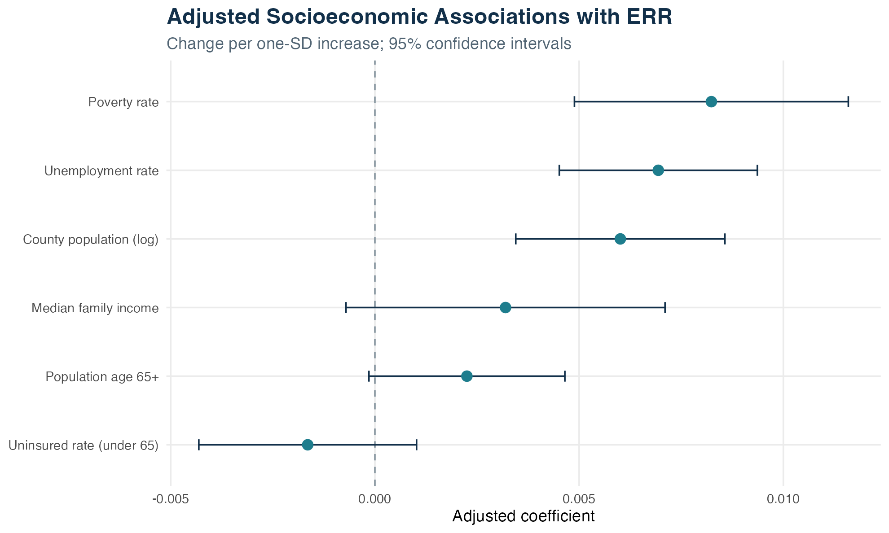

# Hospital Readmission Analysis

> **Community context matters:** after adjusting for hospital characteristics and readmission condition, county poverty, unemployment, and population size remained associated with higher CMS excess readmission ratios.

## Project at a glance

| Scope | Value |
|---|---:|
| Hospital-condition observations | **7,944** |
| Hospitals | **2,444** |
| Counties | **1,197** |
| Observations with ERR > 1 | **55%** |
| Hospital-level ICC | **23%** |

## Business and research question

How do hospital characteristics and county socioeconomic conditions relate to CMS excess readmission ratios (ERR)?

Hospital performance is not observed in isolation. This project integrates public hospital-quality data with county socioeconomic indicators, then models repeated condition-level measurements within hospitals to distinguish hospital-level variation from measured community context.

## Analytical workflow

1. Clean hospital identifiers, measures, ZIP codes, and county FIPS values.
2. Validate key uniqueness and resolve a many-to-many ZIP-to-county join.
3. Join hospital characteristics, CMS readmission performance, and county socioeconomic indicators.
4. Engineer standardized predictors for comparable coefficient interpretation.
5. Compare nested mixed-effects models using likelihood-ratio tests, AIC, and BIC.
6. Fit the final model with REML and export tables, visualizations, and an Excel report.

## Statistical model

A **linear mixed-effects model** was fitted in R with `nlme`.

- **Outcome:** excess readmission ratio
- **Fixed effects:** readmission measure, ownership, emergency services, poverty, unemployment, uninsured rate, income, age 65+, and log population
- **Random effect:** hospital-level intercept
- **Diagnostics and comparison:** likelihood-ratio tests, confidence intervals, AIC, BIC, and intraclass correlation

The random intercept accounts for multiple condition-level observations from the same hospital.

## Key findings

- County poverty: approximately **+0.0082 ERR per 1 SD**
- County unemployment: approximately **+0.0069 ERR per 1 SD**
- Log county population: approximately **+0.0060 ERR per 1 SD**
- Approximately **23%** of residual variation occurred between hospitals

These are adjusted associations, not causal effects.



## Repository structure

```text
R/
  hospital_readmission_full.R       # Complete cleaning, joins, modeling, and export pipeline
data/
  README.md                         # Required inputs and placement instructions
output/
  data_quality_audit.csv
  model_comparison.csv
  mixed_model_coefficients.csv
  model_statistics.csv
  summary_by_measure.csv
  summary_by_ownership.csv
  summary_overall.csv
visuals/
  01_err_distribution.png
  02_err_by_ownership.png
  03_mean_err_by_measure.png
  04_ses_coefficient_plot.png
  05_hospital_random_effects.png
report/
  Khanh_Nguyen_Hospital_Readmission_Analysis.pdf
  Hospital_Readmission_Analysis_Report.xlsx
```

Raw source extracts are not committed because of their size and redistribution considerations. See [data/README.md](data/README.md) for the four required public inputs.

## Reports

- [Portfolio-ready PDF report](report/Khanh_Nguyen_Hospital_Readmission_Analysis.pdf)
- [Formatted Excel analysis report](report/Hospital_Readmission_Analysis_Report.xlsx)
- [Model coefficients](output/mixed_model_coefficients.csv)
- [Model comparison](output/model_comparison.csv)

## Reproduce the analysis

1. Clone or download this repository.
2. Place the four source CSV files listed in [data/README.md](data/README.md) inside `data/`.
3. Open `hospital_readmission_analysis.Rproj`.
4. Install the required packages if needed.
5. Run:

```r
source("R/hospital_readmission_full.R")
```

The script validates inputs and joins, fits the models, and rebuilds the files in `output/`, `visuals/`, and `report/`.

## Tools

**R · dplyr · readr · stringr · ggplot2 · nlme · here · openxlsx · Excel · Tableau-ready data**
